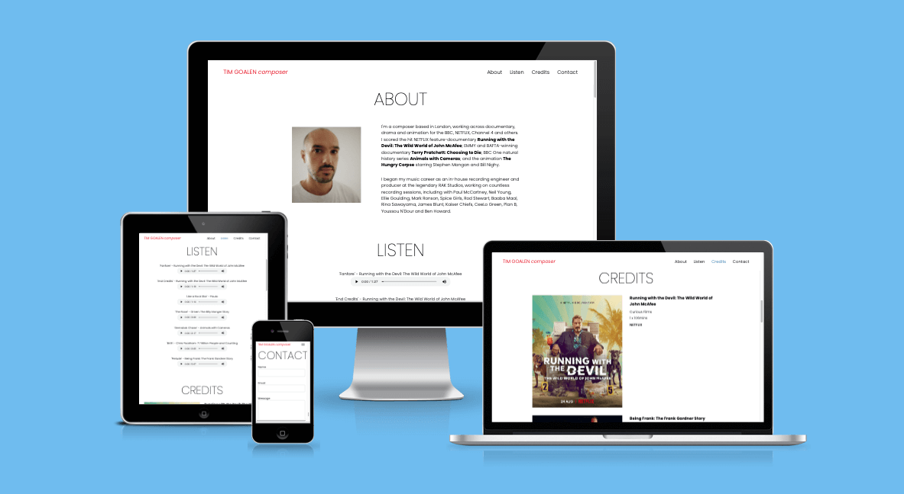
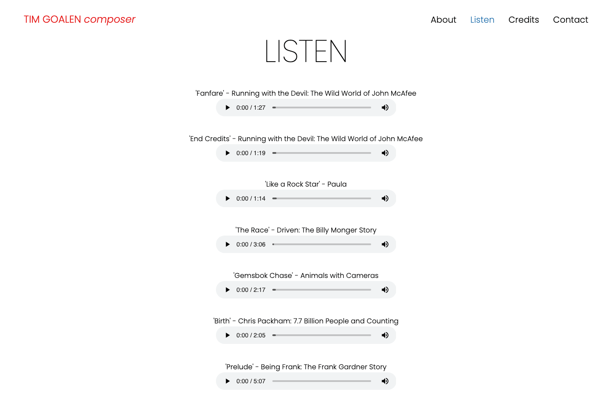
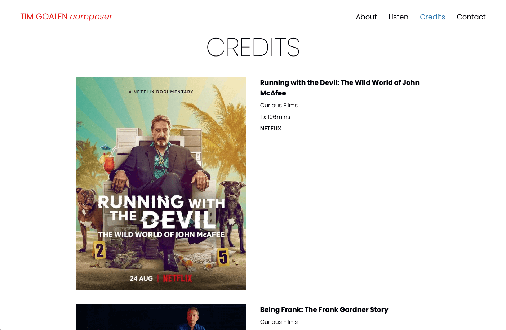
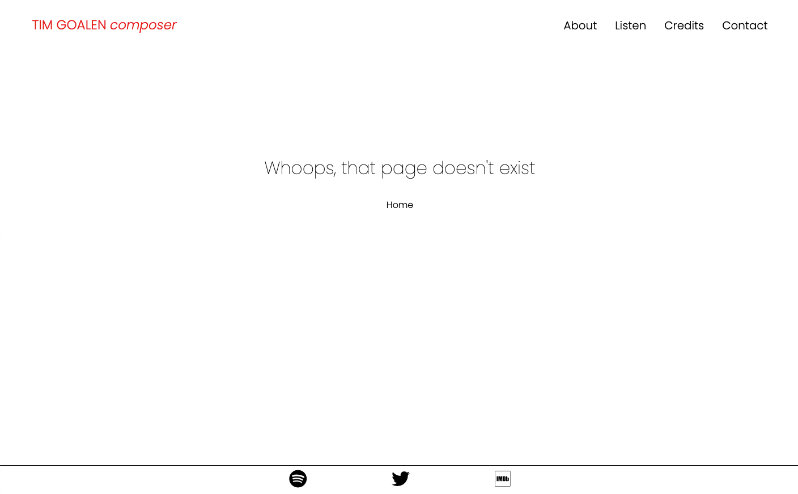

# Tim Goalen - Composer Website

[View the live project here](https://timgoalen.github.io/tg-composer-portfolio)

**TIM GOALEN *composer*** is a portfolio website for myself that showcases my work as a TV composer. The goal of this website is to provide a place where TV professionals (directors, producers, production managers etc.) can find my credits, listen to my work and contact me easily; and for audience members to listen to music from programmes they’ve seen and get in touch.

[!!MERGE THESE 2 INTRO SECTIONS!!]

User 1-

Director/producer looking to find my composer credits/ showreel and get in touch to speak about a project

User 2-

TV audience member looking to listen to music heard on a programme and perhaps get in touch to say they liked it



## User Experience

-   ### User Goals

    -   #### TV Professional User Goals

        1. As a First Time Visitor, I want to easily understand the main purpose of the site and learn more about the organisation.
        2. As a First Time Visitor, I want to be able to easily navigate throughout the site to find content.
        3. As a First Time Visitor, I want to look for testimonials to understand what their users think of them and see if they are trusted. I also want to locate their social media links to see their followings on social media to determine how trusted and known they are.

    -   #### Audience Member User Goals

        1. As a Returning Visitor, I want to find information about coding challenges.
        2. As a Returning Visitor, I want to find the best way to get in contact with the organisation with any questions I may have.
        3. As a Returning Visitor, I want to find community links.

## Design
The design is based on an original prototype that I made using Squarespace.

[View the prototype Squarespace site here](https://www.timgoalen.com)

Reasons for needing update (RE-WRITE)...INCL. cheaper to maintain; improve site accesibility/performance; future more maintainable/updatable.

Changed from multi-page design in the prototype, to single-page design, with sections linked in the navigation to...(explanation)

### Colour Scheme

The site has a contemporary mimimalist aesthetic, based on a monochrome colour palette of white and black, with red and blue accent colours being used sparingly.


### Typography
~~The Montserrat font is the main font used throughout the whole website with Sans Serif as the fallback font in case for any reason the font isn't being imported into the site correctly. Montserrat is a clean font used frequently in programming, so it is both attractive and appropriate.~~
### Imagery
~~Imagery is important. The large, background hero image is designed to be striking and catch the user's attention. It also has a modern, energetic aesthetic.~~

## Features

Mobile-first approach, using responsive units (%, vh and vw) wherever possible, to keep media queries to a minimum.

### Navigation Bar


- A fixed navigation bar is available on every page. 
- Clicking a link takes the user to the desired page section with a smooth scroll effect, and triggers an opacity transition in the selected section, via a `:target` pseudo-class selector.
- The text turns blue as the cursor hovers over it, and remains blue after being clicked to indicate the users current position within the page.

### Mobile Navigation Menu


- On mobile screens the navigation is displayed as an expandable menu via a hamburger icon.
- Once a destination is clicked the menu collapses.

### About


- Diplayed as one column on mobile screens and two columns on tablet screens and larger.
- Features a headshot and two paragraphs of work highlights.

### Listen


- A seven-track audio showreel, made with HTML `<audio>` elements.
- Importantly for UX, JavaScript is used to pause the currently playing audio element if another is played.

explanation & image

### Credits


explanation & image

### Contact & Footer


explanation & image

### Footer (USE ABOVE INSTEAD??)
explanation & image

### Message Received Page


explanation & image

### 404 Error Page


explanation & image

## Technologies Used

- Languages Used:
    -   [HTML5](https://en.wikipedia.org/wiki/HTML5)
    -   [CSS3](https://en.wikipedia.org/wiki/Cascading_Style_Sheets)
    -   [JavaScript](https://en.wikipedia.org/wiki/JavaScript)
- [Git](https://git-scm.com/)
    - Git was used for version control by utilizing the Gitpod terminal to commit to Git and Push to GitHub.
- [GitHub](https://github.com/)
    - GitHub is used to store the projects code after being pushed from Git.
- [Google Fonts](https://fonts.google.com/)
    - Google fonts were used to import the 'Titillium Web' font into the style.css file which is used on all pages throughout the project.
- [Font Awesome](https://fontawesome.com/)
    - Font Awesome was used on all pages throughout the website to add icons for aesthetic and UX purposes.
- birme - https://www.birme.net/
- https://autoprefixer.github.io/ 
- tinyPNG
- https://pagespeed.web.dev
- etc.

## Testing

Syntax errors were tested for with W3C Markup Validator and W3C CSS Validator. No errors were found.

-   [W3C Markup Validator](https://validator.w3.org) - [Results](https://jigsaw.w3.org/css-validator/validator?uri=https%3A%2F%2Ftimgoalen.github.io%2Ftg-composer-portfolio%2Findex.html&profile=css3svg&usermedium=all&warning=1&vextwarning=&lang=en)
***RUN THIS AGAIN - 'controlslist' errors shown on audio elements
-   [W3C CSS Validator](https://jigsaw.w3.org/css-validator) - [Results](https://jigsaw.w3.org/css-validator/validator?uri=https%3A%2F%2Ftimgoalen.github.io%2Ftg-composer-portfolio%2Findex.html&profile=css3svg&usermedium=all&warning=1&vextwarning=&lang=en)

after the first W3C markup validator test i removed the `controlslist` attribute on the `<audio>` elements, as is an experimental attribute and would fail the test. had it for `nodownload` and `noplaybackrate`. In future I will build a custom audio player for the site using JavaScript.


### Lighthouse

!!!SHOW IMAGES & RESULTS

### Devices & Browsers Used for Manual Testing
- iPhone (??)
    - Safari (??)
    - Chrome(??)
- iPad (??)
    - Safari
- Macbook Pro (??)
    - Chrome (??)
    - Safari (??)
- Mac Pro (??)
    - Chrome (??)
    - Safari (??)
    - Firefox (??)

### Manual Testing of User Actions
| Feature | Action | Expected Behaviour | Pass/fail |
|---|---|---|---|
| Navbar | Click on logo | Navigates back to the top of the page | PASS |
| Navbar | Click on "About" | Scrolls to the "About" section | PASS |
| Navbar | Click on "Listen" | Scrolls to the "Listen" section | PASS |
| Navbar | Click on "Credits" | Scrolls to the "Credits" section | PASS |
| Navbar | Click on "Contact" | Scrolls to the "Contact" section | PASS |
| Mobile menu | Click on hamburger icon | Shows navigation menu and icon changes to "X" | PASS |
| Mobile menu | Click on "X" icon | Collapses navigation menu | PASS |
| Mobile menu | Click on link | Navigates to the selected section and menu collapses | PASS |
| Listen | Click on a play button | Plays an audio element | PASS |
| Listen | Click on a pause button | Pauses an audio element | PASS |
| Listen | Click on a transport slider | Navigates to the selected position in the audio file (once buffered) | PASS |
| Listen | Click on a volume icon | Opens the volume control | PASS |
| Listen | Click on the expanded controls three dots | Opens the "Download" and "Playback speed" controls | PASS |
| Listen | Click on a play button when another audio element is playing | Mutes the previously playing audio element | PASS |
| Contact | Click on the "Send" button without filling in the "Name" field | Shows an error message pointing to the "Name" field | PASS |
| Contact | Click on the "Send" button without filling in the "Email" field | Shows an error message pointing to the "Email" field | PASS |
| Contact | Click on the "Send" button without including an @ in the "Email" field | Shows an error message pointing to the "Email" field | PASS |
| Contact | Click on the "Send" button without filling in the "Message" field | Shows an error message pointing to the "Message" field | PASS |
| Contact | Click on the "Send" button | Sends the form and navigates to the "message-received-page.html" | PASS |
| Footer | Click on the Spotify icon | Opens Tim Goalen's Spotify page in a new tab | PASS |
| Footer | Click on the Twitter icon | Opens Tim Goalen's Twitter page in a new tab | PASS |
| Footer | Click on the IMDb icon | Opens Tim Goalen's IMDb page in a new tab | PASS |
| Message Received Page | Click on the "Home" link | Navigates back to the top of the main page | PASS |
| 404 Page | Enter an non-existing url within the site | Displays the "404.html" page | PASS |
| 404 Page | Click on the "Home" link | Navigates back to the top of the main page | PASS |


### Known Bugs

- ???
- ???

## Deployment

### GitHub Pages

The project was deployed to GitHub Pages using the following steps...

1. Log in to GitHub and locate the [GitHub Repository](https://github.com/)
2. At the top of the Repository (not top of page), locate the "Settings" Button on the menu.
    - Alternatively Click [Here](https://raw.githubusercontent.com/) for a GIF demonstrating the process starting from Step 2.
3. Scroll down the Settings page until you locate the "GitHub Pages" Section.
4. Under "Source", click the dropdown called "None" and select "Master Branch".
5. The page will automatically refresh.
6. Scroll back down through the page to locate the now published site [link](https://github.com) in the "GitHub Pages" section.

### Forking the GitHub Repository

By forking the GitHub Repository we make a copy of the original repository on our GitHub account to view and/or make changes without affecting the original repository by using the following steps...

1. Log in to GitHub and locate the [GitHub Repository](https://github.com/)
2. At the top of the Repository (not top of page) just above the "Settings" Button on the menu, locate the "Fork" Button.
3. You should now have a copy of the original repository in your GitHub account.

### Making a Local Clone

1. Log in to GitHub and locate the [GitHub Repository](https://github.com/)
2. Under the repository name, click "Clone or download".
3. To clone the repository using HTTPS, under "Clone with HTTPS", copy the link.
4. Open Git Bash
5. Change the current working directory to the location where you want the cloned directory to be made.
6. Type `git clone`, and then paste the URL you copied in Step 3.

```
$ git clone https://github.com/YOUR-USERNAME/YOUR-REPOSITORY
```

7. Press Enter. Your local clone will be created.

```
$ git clone https://github.com/YOUR-USERNAME/YOUR-REPOSITORY
> Cloning into `CI-Clone`...
> remote: Counting objects: 10, done.
> remote: Compressing objects: 100% (8/8), done.
> remove: Total 10 (delta 1), reused 10 (delta 1)
> Unpacking objects: 100% (10/10), done.
```

Click [Here](https://help.github.com/en/github/creating-cloning-and-archiving-repositories/cloning-a-repository#cloning-a-repository-to-github-desktop) to retrieve pictures for some of the buttons and more detailed explanations of the above process.

## Credits

### Code

- ???
- ???

### Content

- ???
- ???

### Media

- ???
- ???

### Acknowledgements

-   My mentor Brian Macharia for his invaluable guidance.

-   Tutor support at Code Institute for their help with troubleshooting.

**DO A SPELLCHECK!!!!