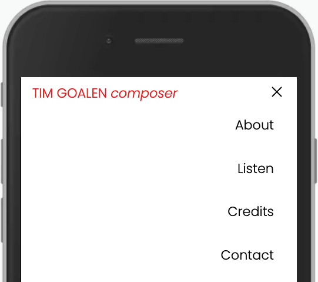
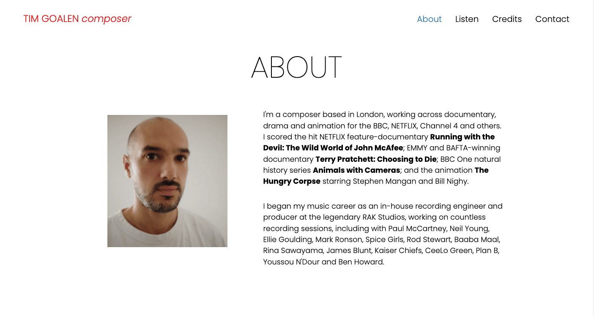
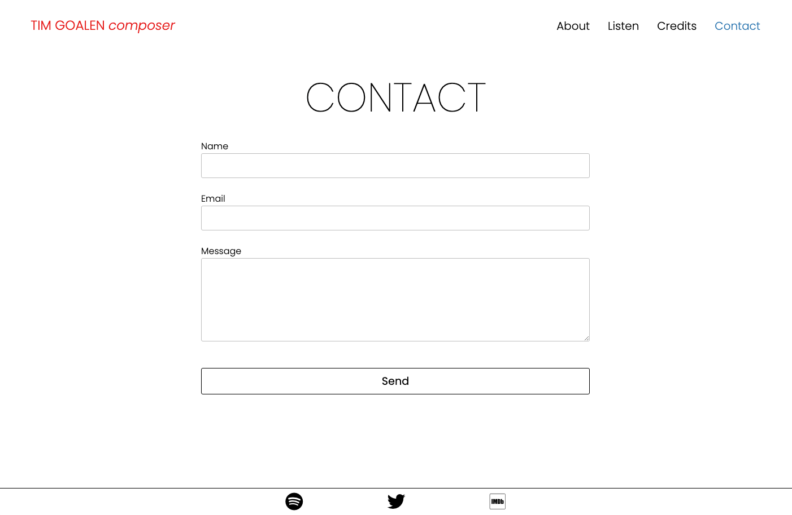
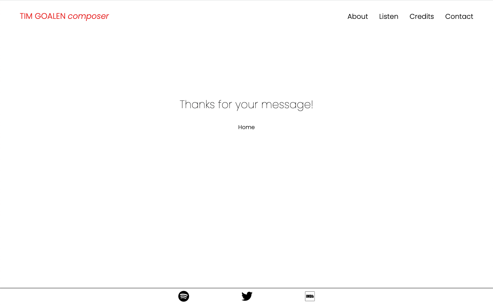

# Tim Goalen - Composer Website


[View the live project here](https://timgoalen.github.io/tg-composer-portfolio)

**TIM GOALEN *composer*** is a portfolio website for myself that showcases my work as a TV composer. The goal of this website is to provide a place where:
1. TV professionals (directors, producers and production managers) can find my credits, listen to my work and contact me easily.
2. Audience members can listen to music from programmes they’ve seen and get in touch.

## Design
The design is based on an original prototype that I previously built using Squarespace.

[View the prototype Squarespace site here](https://www.timgoalen.com)

Aims for improvements on the Squarespace version include:
- improving performance & accesibility
- increasing the ease of implementing future custom features
- reducing yearly subscription cost

The main design updates include:
- simplifing the site from a multi-page to a single-page design
- ommitting the separate landing page, improving UX by taking the user directly to content
- featuring just selected credits (highlights) in the Credits and Listen sections
- improving the colour scheme and typography
- improving feedback from user interactions
    - hover effects on menu items and input fields
    - transition effects on page load and when navigattion scrolls to a section

The site was built with a **mobile-first** approach, using responsive units (`%`, `vh` and `vw`) where possible, to keep media queries to a minimum.

### Colour Scheme

The site has a contemporary mimimalist aesthetic, based on a monochrome colour palette of white and black, with red and blue accent colours being used sparingly.


### Typography
The site uses a single font - 'Poppins' - with the browser-default sans serif as a fallback in case tyhe main font fails to load correctly. Poppins is a contemporary font that fit the mimimalist aesthetic by it by it's design being based on pure geometry.

The oversized section titles use the thin 100-weight version of the font, with a responsive font-size of
`calc(4rem + 0.5vw)`.

Similar responsive font-sizes are also used for the logo, navbar links and 'About' section paragraph text.

Google Fonts was used to import the font at the top of the linked CSS file.

### Imagery

Site imagery consists of a profile headshot at the top of the page and the project promotional images in the 'Credits' section.

## Features

### Navigation Bar


- A fixed navigation bar is available on every page. 
- Clicking a link takes the user to the desired page section with a smooth-scroll effect, and triggers an opacity transition in the selected section, via a `:target` pseudo-class selector.
- The text turns blue as the cursor hovers over it, and remains blue after being clicked to indicate the users current position within the page.

### Mobile Navigation Menu


- On mobile screens the navigation is displayed as an expandable menu via a hamburger icon.
- Once a destination is clicked the menu collapses.

### About


- Diplayed as one column on mobile screens and two columns on tablet screens and larger.
- Features a headshot and two paragraphs detailing work highlights.

### Listen


- A seven-track audio showreel, made with HTML `<audio>` elements.
- JavaScript is used to pause the currently playing audio element if another is played, which is crucial for good UX.

### Credits


- List of selected credits, with official photos, programme title, production company, runtime and broadcaster information.
- Single-column layout on mobile devices and two columns on desktop screens.
### Contact & Footer


- Includes a contact form, with input validation on all fields.
- The footer includes links to my Spotify, Twitter and IMDb pages.

### Message Received Page


- The user is taken to this Message Received page after succesfully submitting the contact form. They offered a new 'Home' button to return home, as well as access to the nav bar and footer.

### 404 Error Page


- A custom page if the user tries to navigate to a page URL tha doesn't exist or can't be found within the site.

## Future Feature Implementations

- A custom audio player, bult with JavaScript
    - with ability to not display controls such as 'download', 'playback speed', 'forward/backward skip'; and design improvements
- Connect the form submit information to an email account
- Improve the hamburger navigation menu, with opening & closing transitions
- Sections that take up 100% of the veiwport height, with animation effects on scroll

## Technologies Used

- Languages Used:
    -   [HTML5](https://en.wikipedia.org/wiki/HTML5)
    -   [CSS3](https://en.wikipedia.org/wiki/Cascading_Style_Sheets)
    -   [JavaScript](https://en.wikipedia.org/wiki/JavaScript)
- [Visual Studio Code](https://code.visualstudio.com/) - as the code editor.
- [Git](https://git-scm.com/) - for version control, using the Gitpod IDE.
- [GitHub](https://github.com/) - for storing the project.
- [Chrome Developer Tools](https://developer.chrome.com/docs/devtools/) - to troubleshoot code.
- [Google Fonts](https://fonts.google.com/) - used to import the 'Poppins' font.
- [Font Awesome](https://fontawesome.com/) - for the social media icons in the footer and the award icons in the 'Credits' section.
- [Favicon.io](https://favicon.io/) - to create the favicons.
- [Birme](https://www.birme.net/) - to convert the images into WebP format.
- [TinyPNG](https://tinypng.com/) - to compress the images.
- [Autoprefixer](https://autoprefixer.github.io/) - to add vendor prefixes. 
- [PageSpeed Insights](https://pagespeed.web.dev/) - for automated testing of performance, accessibilty, best practices and SEO.
- [WebAIM WAVE](https://wave.webaim.org/) - for automated testing of accesibility.
- [WebAIM Contrast Checker](https://webaim.org/resources/contrastchecker/) - to check colour contrast accesibility.
- [W3C Markup Validator](https://validator.w3.org) - to test HTML code.
- [W3C CSS Validator](https://jigsaw.w3.org/css-validator) - to test CSS code.
- [JSHint](https://jshint.com/) - to test JavaScript code.

## Testing

Syntax errors were tested for with [W3C Markup Validator](https://validator.w3.org) and [W3C CSS Validator](https://jigsaw.w3.org/css-validator). No errors were found in the published version of the site.

Improvements following initial testing:
- After the first W3C markup validator test i removed the `controlslist` attribute on the `<audio>` elements. Being an experimental attribute it failed the validator. I had included it for `nodownload` and `noplaybackrate` values, which disable the controls for downloading the audio file and changing the playback speed. In future I will build a custom audio player for the site using JavaScript, to include this functionality.
- Correctly nesting the footer within the `<body>` element in the 'message-received.html' and '404.html' pages.

### PageSpeed Insights

#### Desktop:


#### Mobile:


A large improvement on the prototype Squarespace site:
<details><summary>Desktop</summary>

</details>
<details><summary>Mobile</summary>

</details>

Improvements made following inital testing:
- Resizing images to 150% of their max diaplyed size.
- Serving images in WebP format, with a JPEG as a fallback for browsers that don't support WebP. Through the picture `<picture>` and `<source>` elements.
- Adding explicit `width` and `height` to all images, to reduce layout shift as the browser loads the image.
- INCREASING CONTRAST????

### accesibility testing

???wave???contrast etc.

### Devices & Browsers Used for Manual Testing
- iPhone SE (2020)
    - Safari (v16.1)
    - Chrome (v112)
- iPad (6th Generation)
    - Chrome (v111)
    - Safari (v15)
- Mac Pro (Mid 2012)
    - Chrome (v112)
    - Safari (v12.1.2)
    - Firefox (v112.0)
- Dell Chromebook 3120
    - Chrome (v103)

### Manual Testing of User Actions
| Feature | Action | Expected Behaviour | Pass/fail |
|---|---|---|---|
| Navbar | Click on logo | Navigates back to the top of the page | PASS |
| Navbar | Click on "About" | Scrolls to the "About" section | PASS |
| Navbar | Click on "Listen" | Scrolls to the "Listen" section | PASS |
| Navbar | Click on "Credits" | Scrolls to the "Credits" section | PASS |
| Navbar | Click on "Contact" | Scrolls to the "Contact" section | PASS |
| Navbar | Click on any link | Opacity transition on target section | PASS |
| Mobile menu | Click on hamburger icon | Shows navigation menu and icon changes to "X" | PASS |
| Mobile menu | Click on "X" icon | Collapses navigation menu | PASS |
| Mobile menu | Click on link | Navigates to the selected section and menu collapses | PASS |
| About | Page Load | Opacity transition | PASS |
| Listen | Click on a play button | Plays an audio element | PASS |
| Listen | Click on a pause button | Pauses an audio element | PASS |
| Listen | Click on a transport slider | Navigates to the selected position in the audio file (once buffered) | PASS |
| Listen | Click on a volume icon | Opens the volume control | PASS |
| Listen | Click on the expanded controls three dots | Opens the "Download" and "Playback speed" controls | PASS |
| Listen | Click on a play button when another audio element is playing | Mutes the previously playing audio element | PASS |
| Contact | Click on the "Send" button without filling in the "Name" field | Shows an error message pointing to the "Name" field | PASS |
| Contact | Click on the "Send" button without filling in the "Email" field | Shows an error message pointing to the "Email" field | PASS |
| Contact | Click on the "Send" button without including an @ in the "Email" field | Shows an error message pointing to the "Email" field | PASS |
| Contact | Click on the "Send" button without filling in the "Message" field | Shows an error message pointing to the "Message" field | PASS |
| Contact | Click on the "Send" button | Sends the form and navigates to the "message-received-page.html" | PASS |
| Footer | Click on the Spotify icon | Opens Tim Goalen's Spotify page in a new tab | PASS |
| Footer | Click on the Twitter icon | Opens Tim Goalen's Twitter page in a new tab | PASS |
| Footer | Click on the IMDb icon | Opens Tim Goalen's IMDb page in a new tab | PASS |
| Message Received Page | Click on the "Home" link | Navigates back to the top of the main page | PASS |
| 404 Page | Enter an non-existing url within the site | Displays the "404.html" page | PASS |
| 404 Page | Click on the "Home" link | Navigates back to the top of the main page | PASS |

### Known Bugs

- ??? TODOOOOO!!!
- ???

## Deployment

### GitHub Pages

The project was deployed to GitHub Pages using the following steps...

1. Log in to GitHub and locate the [GitHub Repository](https://github.com/timgoalen/tg-composer-portfolio)
2. At the top of the Repository (not top of page), locate the "Settings" Button on the menu.
3. Scroll down the Settings page until you locate the "GitHub Pages" Section.
4. Under "Source", click the dropdown called "None" and select "Master Branch".
5. The page will automatically refresh.
6. Scroll back down through the page to locate the now published site in the "GitHub Pages" section.

### Forking the GitHub Repository

By forking the GitHub Repository we make a copy of the original repository on our GitHub account to view and/or make changes without affecting the original repository by using the following steps...

1. Log in to GitHub and locate the [GitHub Repository](https://github.com/timgoalen/tg-composer-portfolio)
2. At the top of the Repository (not top of page) just above the "Settings" Button on the menu, locate the "Fork" Button.
3. You should now have a copy of the original repository in your GitHub account.

### Making a Local Clone

1. Log in to GitHub and locate the [GitHub Repository](https://github.com/timgoalen/tg-composer-portfolio)
2. Under the repository name, click "Clone or download".
3. To clone the repository using HTTPS, under "Clone with HTTPS", copy the link.
4. Open Git Bash
5. Change the current working directory to the location where you want the cloned directory to be made.
6. Type `git clone`, and then paste the URL you copied in Step 3.

```
$ git clone https://github.com/YOUR-USERNAME/YOUR-REPOSITORY
```

7. Press Enter. Your local clone will be created.

```
$ git clone https://github.com/YOUR-USERNAME/YOUR-REPOSITORY
> Cloning into `CI-Clone`...
> remote: Counting objects: 10, done.
> remote: Compressing objects: 100% (8/8), done.
> remove: Total 10 (delta 1), reused 10 (delta 1)
> Unpacking objects: 100% (10/10), done.
```

Click [Here](https://help.github.com/en/github/creating-cloning-and-archiving-repositories/cloning-a-repository#cloning-a-repository-to-github-desktop) to retrieve pictures for some of the buttons and more detailed explanations of the above process.

## Credits

### Code

- Responsive Navbar:
    - [codebubb](https://www.youtube.com/watch?v=c9jNIYQ1IuI)
- Underline active section in menu:
    - [W3Schools](https://www.w3schools.com/howto/howto_js_active_element.asp)
- Pause playing audio when different audio is played:
    - Javascript solution from [Stack Overflow](https://stackoverflow.com/questions/19790506/multiple-audio-html-auto-stop-other-when-current-is-playing-with-javascript)
- Footer social links using Font Awesome:
    - Code Institute ['Love Running'](https://github.com/Code-Institute-Org/love-running-2.0) walkthrough project

### Content

- All content written by the developer.

### Media

- All audio content owned by the developer.
- Image credits:
    - Headshot owned by the developer.
    - Running with the Devil: The Wild World of John McAfee - owned by NETFLIX/Curious Films, used for promotional purposes only.
    - Running with the Devil: The Wild World of John McAfee - owned by NETFLIX/Curious Films, used for promotional purposes only.
    - Being Frank: The Frank Gardner Story - owned by BBC TWO/Curious Films, used for promotional purposes only.
    - The Parkinson's Drug Trial: A Miracle Cure? - owned by BBC TWO/Passionate Productions, used for promotional purposes only.
    - Driven: The Billy Monger Story - owned by BBC TWO/Oxford Scientific Films, used for promotional purposes only.
    - Animals with Cameras - owned by BBC ONE/BBC Natural History Unit, used for promotional purposes only.
    - Terry Pratchett: Back in Black - owned by BBC TWO/BBC Studios, used for promotional purposes only.
    - The Hungry Corpse - owned by Rankin Film Productions/Beakus, used for promotional purposes only.
    - Terry Pratchett: Choosing to Die - owned by BBC TWO/Keo Films, used for promotional purposes only.

### Acknowledgements

-   My mentor Brian Macharia for his invaluable guidance.

-   Tutor support at Code Institute for their help with troubleshooting.

**DO A SPELLCHECK!!!!